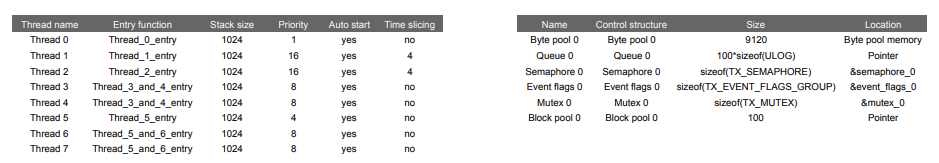
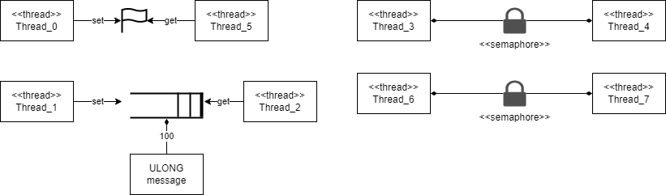

# sistemasEmbarcados
Laboratórios da disciplina de sistemas embarcados - 2021/2

## LAB 1
O resultado do arquivo main.cpp aparece no terminal I/O, visível durante o debug do código

## LAB 2
A variável ui32Loop é declarada como volatile dentro da main porque ela pode ser alterada por eventos externos

## LAB 5
Tabelas:

Diagrama:
